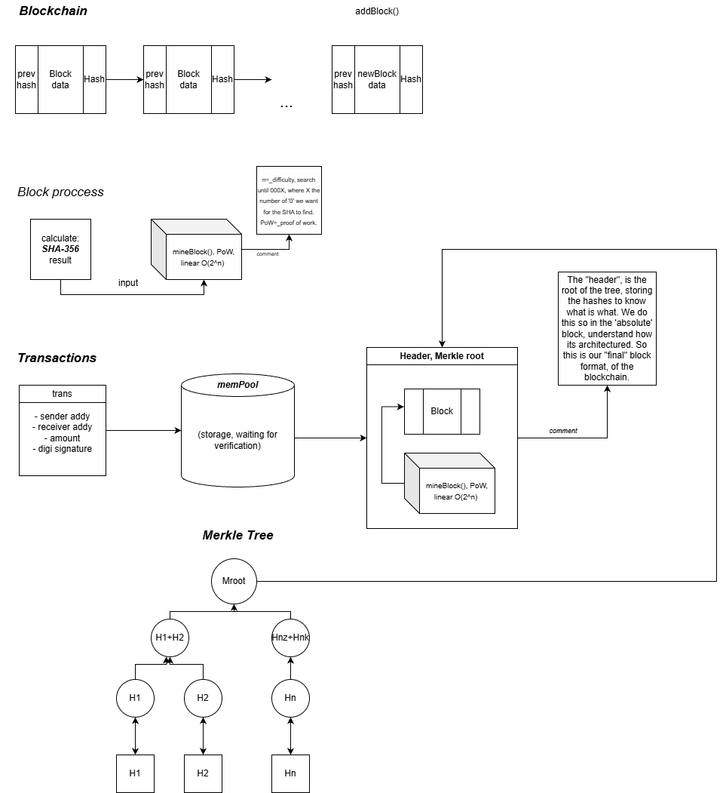

<p align="center">
  
</p>


# TODOS:
1) transactions:
    - Merkle tree where the root is stored in the block.h
    - in block.h replace "std::string data", with a vector (used for transactions.)
2) minting:
    - bta...

# Very simple blockchain creation - tzak

## 1. mining a block
from the files block.cpp/h:
1. We create a constructor Block() with the block info while catching a timestamp in Unix.
2. With calculateHash() and using SHA-256 algorithm from the openssl/sha.h library, we create the blocks metadata. (we turn the data->hash but not reversible)
3. We "mine" a block using proof of work (pc power) and calculating a hash until we finde 000XXXX...XXX, 4 zeros. Then we can say that we have a valid block.

## 2. Ledger Managment, the blockchain
from the files blockchain.cpp/h:
1. We create a constructor Blockchain(), which we give "birth" to lets say block 0 etc..., to start the chain.
2. With addBlock() we crete the block (new blocks), which it retrieves the hash's recent block of the chain using "prevHash" from 1.2->calculateHash() and then "mine".
3. isChainValid(): we check 2 factors: if the block's hash match the actual data and if the prevHashes are linked correctly.

## 3. small transactions
from the files trans.cpp/h:
1. We create a struct Transaction with a sender and receiver vars. and a helper function toString() (prefixxed) to turn it onto a string and use it to be hashed by the block.

## Output of: 18/2/2026
# using SHA-256:
```
./blockchain
Mining block 1...
Block Mined! Hash: 00009cd1fd17d0b6d825d5b0b76715032c674184521294e20c7c1b154048e12a
Mining block 2...
Block Mined! Hash: 0000feda1a412a6ea8ec930017396f3a8046c890ed0841b03a0b6f2c55906f63
Is chain valid? Yes
```
# using a small hash function:
```
./blockchain
Mining block 1...
Block Mined! Hash: 0000c818325d846f
Mining block 2...
Block Mined! Hash: 0000fc9423493e7c
Is chain valid? Yes
```

