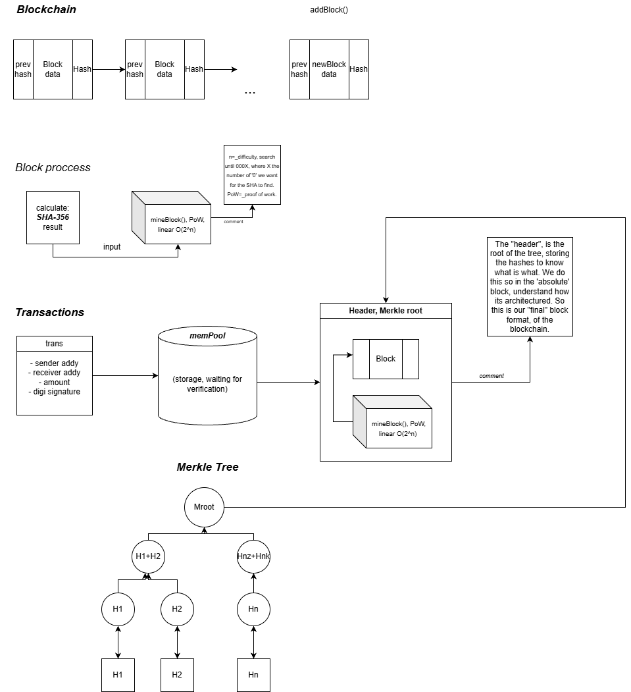

<p align="center">
  
</p>

# TODOS:
1) Small cleanup of the merkle tree situation (clean code), and then procced to what ever occurs.
2) *SOS* Signature verification (ECDSA)
2) minting:
    - TBA...

# DONES:
1) transactions:
    - [DONE] Merkle tree where the root is stored in the block.h
    - [DONE] Implement the Merkle.cpp && Merkle.h to the other files and Makefile.
    1. *Note:*
       - Flushing slow mining? Yes — printing and flushing to the terminal every hash trial creates extra I/O work and noticeably increases elapsed time, especially on consoles. Throttling updates (as implemented) keeps useful visual feedback while minimizing the overhead.*
    2) *Note:* 
        - difficulty 4 → ~65k attempts
        - difficulty 5 → ~1.05M attempts
        - difficulty 6 → ~16.8M attempts
        With PRINT_EVERY = 1000, number of prints ≈ attempts / 1000. If each print+flush costs p milliseconds, added time ≈ (attempts/1000) times p.
        - If p = 0.5 ms, difficulty 6 adds ≈ 16.8M/1000 times 0.5ms ≈ 8.4s.
        - If p = 0.1 ms, difficulty 6 adds ≈ 1.68s.*
    - [DONE] In block.h replace "std::string data", with a vector (used for transactions.)


# Very simple blockchain creation - tzak

## 1. mining a block
from the files block.cpp/h:
1. We create a constructor Block() with the block info while catching a timestamp in Unix.
2. With calculateHash() and using SHA-256 algorithm from the openssl/sha.h library, we create the blocks metadata. (we turn the data->hash but not reversible)
3. We "mine" a block using proof of work (pc power) and calculating a hash until we finde 000XXXX...XXX, 4 zeros. Then we can say that we have a valid block.

## 2. Ledger Managment, the blockchain
from the files blockchain.cpp/h:
1. We create a constructor Blockchain(), which we give "birth" to lets say block 0 etc..., to start the chain.
2. With addBlock() we crete the block (new blocks), which it retrieves the hash's recent block of the chain using "prevHash" from 1.2->calculateHash() and then "mine".
3. isChainValid(): we check 2 factors: if the block's hash match the actual data and if the prevHashes are linked correctly.

## 3. small transactions
from the files trans.cpp/h:
1. We create a struct Transaction with a sender and receiver vars. and a helper function toString() (prefixxed) to turn it onto a string and use it to be hashed by the block.
2. Merkle tree implementation: we created a new utility hash function, to convert them into strings and (before that) store them in a tree. As we have all the start up (lets say), hashes on the current (last) level of the tree, we hash the already hashed items. This way we are going up a level combining the hashes, until we reach 1 final hash name Mroot (merkle root) that stores the info of the root that tells us that all transactions are included in the block, and any change to a transaction would change the root hash, making it easy to detect tampering.


# Output of: 18/2/2026
## using SHA-256:
```
./blockchain
Mining block 1...
Block Mined! Hash: 00009cd1fd17d0b6d825d5b0b76715032c674184521294e20c7c1b154048e12a
Mining block 2...
Block Mined! Hash: 0000feda1a412a6ea8ec930017396f3a8046c890ed0841b03a0b6f2c55906f63
Is chain valid? Yes
```
## using a small hash function:
```
./blockchain
Mining block 1...
Block Mined! Hash: 0000c818325d846f
Mining block 2...
Block Mined! Hash: 0000fc9423493e7c
Is chain valid? Yes
```

# Output of: 6/3/2026
```
time ./al #instead of ./Blockchain, for ease
Mining block[1]...
Block MINED with hash: 0000154da5660b83d08cbf7fbafd3ab35e5709a5fcc279387e6e00c519fc0864
Mining block[2]...
Block MINED with hash: 00006841d57ae68c616bb6c259b03c60f4e32eaa63f570cf3c5fc534d764fdcf
Mining block[3]...
Block MINED with hash: 0000c00cba1cab678a7bdec652aeab085f6fb10a3e8b866efa61bb241d4b5167
Mining block[4]...
Block MINED with hash: 00006b193844c3c166d20e9f89e26b2c87208e88529e54252d0f2306b3c19d72
Valid chain: True
Total minutes to mine (start→finish): 0.05 minutes.

real    0m3.682s
user    0m3.652s
sys     0m0.021s
```