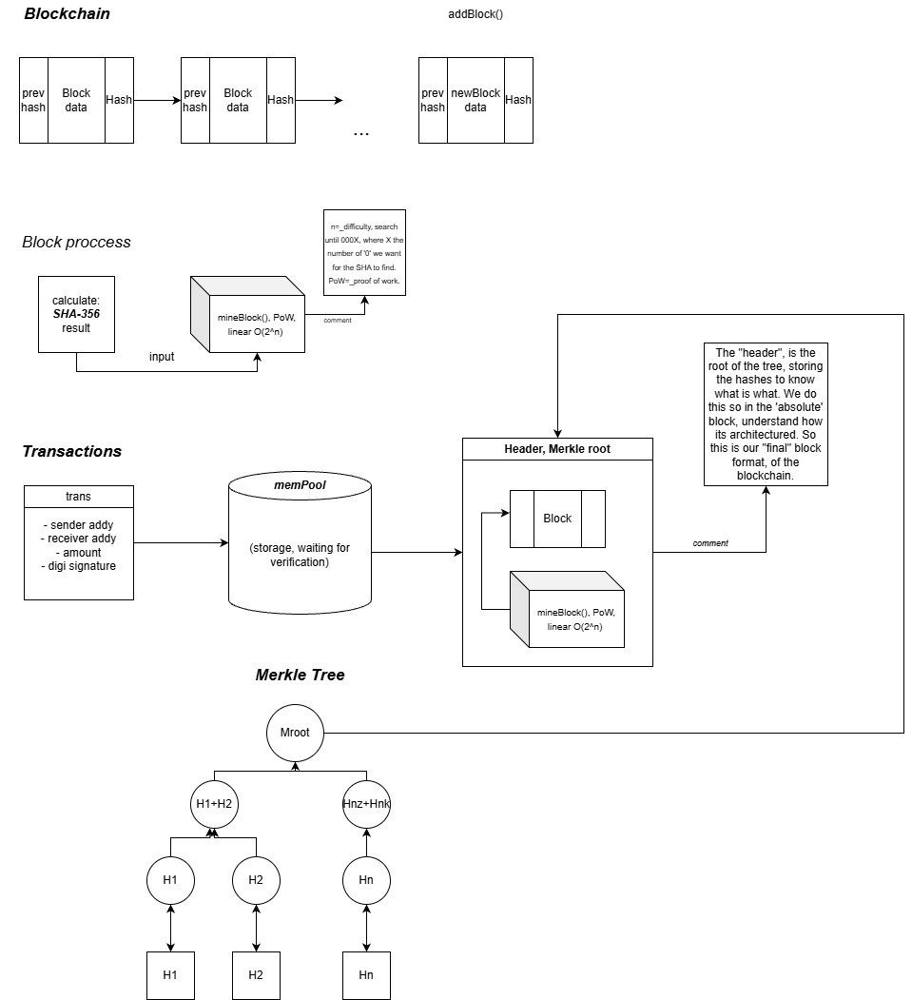

<p align="center">
  
</p>

# TODOS:
1) *SOS* Signature verification (ECDSA)
2) implement ECDSA in code, hands on
0) minting:
    - TBA...

# DONES:
1) Signatures:
    - read Theory, wrote READme


# Very simple blockchain creation - tzak

## 1. mining a block
from the files block.cpp/h:
1. We create a constructor Block() with the block info while catching a timestamp in Unix.
2. With calculateHash() and using SHA-256 algorithm from the openssl/sha.h library, we create the blocks metadata. (we turn the data->hash but not reversible)
3. We "mine" a block using proof of work (pc power) and calculating a hash until we finde 000XXXX...XXX, 4 zeros. Then we can say that we have a valid block.

## 2. Ledger Managment, the blockchain
from the files `blockchain.cpp/h`:
1. We create a constructor Blockchain(), which we give "birth" to lets say block 0 etc..., to start the chain.
2. With `addBlock()` we crete the block (new blocks), which it retrieves the hash's recent block of the chain using "prevHash" from 1.2->`calculateHash()` and then "mine".
3. `isChainValid()`: we check 2 factors: if the block's hash match the actual data and if the prevHashes are linked correctly.

## 3. Small Transactions & The Merkle Tree
From the files `trans.cpp` and `trans.h`:

1. **The Transaction Struct:** We created a `Transaction` struct with sender and receiver variables, alongside a helper function toString(). This turns the transaction into a string so it can be securely hashed by the block.
2. **Merkle Tree Implementation:** We created a new utility hash function to convert transactions into strings and store them in a tree structure. Starting with all the initial transaction hashes at the bottom level of the tree, we hash the pairs of items together. We continue going up level by level, combining the hashes until we reach 1 final hash named **Mroot (Merkle Root)**. This root proves that all transactions are included in the block; any change to a single transaction would drastically change the root hash, making it easy to detect tampering.

**Implementation Checklist:**
- [x] In `block.h`, replace std::string data with a vector used for transactions.
- [x] Implement the Merkle Tree where the root is stored directly in the block header.
- [x] Implement `merkle.cpp` and `merkle.h` and link them to the main project and Makefile.
---
### Performance Notes & Throttling
* **Does flushing slow down mining?** Yes. Printing and flushing to the terminal on every single hash trial creates extra I/O work and noticeably increases elapsed time, especially on consoles. Throttling the updates (as implemented) keeps useful visual feedback while minimizing this overhead.
* **The Math Behind Difficulty & Printing:**
  - Difficulty 4 → ~65k attempts
  - Difficulty 5 → ~1.05M attempts
  - Difficulty 6 → ~16.8M attempts

  With PRINT_EVERY = 1000, the number of prints ≈ (attempts / 1000). If each print+flush costs **p** milliseconds, the added time is roughly(attempts / 1000) * p.
  - If p = 0.5 ms, difficulty 6 adds ≈ 8.4s to the total mining time.
  - If p = 0.1 ms, difficulty 6 adds ≈ 1.68s to the total mining time.

## 4. Signature Verifications - ECDSA
Before implementing anything, must understand how the openssl library works. Ive generated a small test file to implement a single signature using various libraries from openssl. In general tho, the steps for a correct signature verifications are:
1. We have: a constant *prime* number `n` and a generator point `G` (where G={x, y}). 
2. From those two now we need to generate a: `privKey` and a `pubKey`. The *private key* is not that hard to create as with a mathimatical "formula" we generate it as a random integer in the range of [1, n-1]. The *public key* is a bit more complex because we add an extra step. To find the public key we must multiply the private key with the generator point G: **`pubKey = privKey * G`**. That is called EC point multiplication (EC:Elliptic Curve).

---
3. Now for the ECDSA sign we must:
    - Using SHA256 calculate the message's hash, so we have **`h = hash(msg)`**
    - In the range of [2, n-2] we find a random (secure lets say) **k** for calculating random point, signature proofs ect..., relative prime to n-1.
    - Calculating the **R**andom point **R = k * G** (R is on the 'x' coordinate) -> **`r = R.x`**
    - Calculating the signature proof: **`s = k^-1(h + r * privKey)(mod n)`**.
    - *The calculated signature {r, s} is a pair of integers, each in the range [1...n-1]. It encodes the random point R = k * G, along with a proof s, confirming that the signer knows the message h and the private key privKey. The proof s is by idea verifiable using the corresponding pubKey.*
    ### Signature verification
    - **Verification:** The network takes the $\{r, s\}$ pair, the message hash $h$, and the sender's pubKey. Using curve mathematics, the network reverses the operation to find the point $R$. If the $x$-coordinate of the recovered point matches the $r$ from the signature, it is verified as TRUE.
---
4. ### References
    * [ECDSA: Signing and Verifying Messages](https://cryptobook.nakov.com/digital-signatures/ecdsa-sign-verify-messages)
    * [ElGamal Signature Scheme (Wikipedia)](https://en.wikipedia.org/wiki/ElGamal_signature_scheme)
    # Output of: 12/3/2026
    ```
    small signature: (in Hex)
        Private Key (KEEP SECRET):
    556E174F1739B738BE090F7BB9A6BC33F6E4086FDAF8FFD6B92157A014CAED8D

        Public Key (YOUR ADDRESS):
    04AB9F9F7F8E24084E27B43BE8B0DBBD7EF88DD6B99171D643853973A3EF62A57AB238A8BC1722971BE6F9032051BB421A6905749EDC1AA9DA8D17E67A66821B7C
    ```

# Output of: 18/2/2026
## using SHA-256:
```
./blockchain
Mining block 1...
Block Mined! Hash: 00009cd1fd17d0b6d825d5b0b76715032c674184521294e20c7c1b154048e12a
Mining block 2...
Block Mined! Hash: 0000feda1a412a6ea8ec930017396f3a8046c890ed0841b03a0b6f2c55906f63
Is chain valid? Yes
```
## using a small hash function:
```
./blockchain
Mining block 1...
Block Mined! Hash: 0000c818325d846f
Mining block 2...
Block Mined! Hash: 0000fc9423493e7c
Is chain valid? Yes
```

# Output of: 6/3/2026
```
time ./al #instead of ./Blockchain, for ease
Mining block[1]...
Block MINED with hash: 0000154da5660b83d08cbf7fbafd3ab35e5709a5fcc279387e6e00c519fc0864
Mining block[2]...
Block MINED with hash: 00006841d57ae68c616bb6c259b03c60f4e32eaa63f570cf3c5fc534d764fdcf
Mining block[3]...
Block MINED with hash: 0000c00cba1cab678a7bdec652aeab085f6fb10a3e8b866efa61bb241d4b5167
Mining block[4]...
Block MINED with hash: 00006b193844c3c166d20e9f89e26b2c87208e88529e54252d0f2306b3c19d72
Valid chain: True
Total minutes to mine (start→finish): 0.05 minutes.

real    0m3.682s
user    0m3.652s
sys     0m0.021s
```